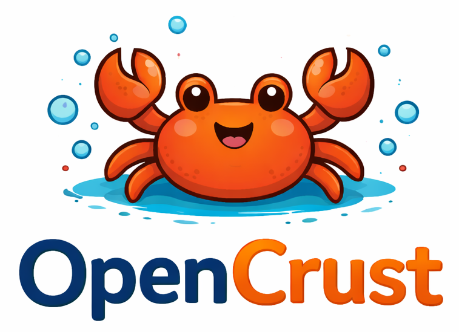

<p align="center">
  
</p>

<h1 align="center">OpenCrust - Trust the Crust</h1>

<p align="center">
  <strong>A personal AI assistant platform, written in Rust.</strong>
</p>

<p align="center">
  <a href="https://github.com/opencrust-org/opencrust/actions"></a>
  <a href="https://github.com/opencrust-org/opencrust/blob/main/LICENSE"></a>
  <a href="https://github.com/opencrust-org/opencrust/issues"></a>
  <a href="https://github.com/opencrust-org/opencrust/issues?q=label%3Agood-first-issue+is%3Aopen"></a>
</p>

<p align="center">
  <a href="#getting-started">Getting Started</a> &middot;
  <a href="#features">Features</a> &middot;
  <a href="#architecture">Architecture</a> &middot;
  <a href="#contributing">Contributing</a> &middot;
  <a href="https://github.com/opencrust-org/opencrust/issues">Roadmap</a>
</p>

---

Rewritten from [OpenClaw](https://github.com/openclaw/openclaw). High-performance, low-resource, single-binary. Same multi-channel, multi-LLM architecture with the safety, speed, and deployment simplicity that Rust provides.

## Why Rust?

| Benefit | What it means for you |
|---------|----------------------|
| **Single binary** | `cargo install opencrust` and you're done. No Node.js, no pnpm, no runtime dependencies. |
| **Low memory** | Runs comfortably on a Raspberry Pi alongside local LLMs. 10-50x less RAM than the Node.js version. |
| **Always-on reliability** | Memory safety without garbage collection pauses. If it compiles, it runs. |
| **Fast startup** | Sub-second cold start vs multi-second Node.js boot. |
| **Easy cross-compilation** | Build for Linux ARM, x86, macOS from a single machine. |

## Features

### LLM Providers
- **Anthropic Claude** — full support with streaming (SSE)
- **OpenAI / compatible APIs** — GPT-4o, Azure, local endpoints via `base_url`
- **Ollama** — local models with streaming support

### Telegram Bot
- **Streaming responses** — text appears progressively as the LLM generates, with 1s buffer for short replies
- **Markdown formatting** — automatic MarkdownV2 conversion with plain text fallback
- **Bot commands** — `/start`, `/help`, `/clear`, `/pair`, `/users`
- **User allowlist** — first user auto-becomes owner, invite others via 6-digit pairing codes
- **Typing indicators** — active during generation and tool execution
- **Context window management** — automatic history trimming to stay within token limits

### Agent Runtime
- **Tool execution loop** — bash, file read/write, web fetch with up to 10 tool iterations
- **Memory recall** — SQLite-backed conversation memory with vector search (sqlite-vec)
- **Embedding support** — Cohere embeddings for semantic memory retrieval
- **Prompt injection detection** — input validation and sanitization

### Infrastructure
- **Credential vault** — AES-256-GCM encrypted API key storage (`~/.opencrust/credentials/vault.json`)
- **Config hot-reload** — edit `config.yml` and changes apply without restart (agent settings, log level)
- **Daemonization** — `opencrust start --daemon` with PID file and log redirection
- **WebSocket gateway** — session resume, ping/pong heartbeat, graceful shutdown
- **Interactive setup** — `opencrust init` wizard guides through provider and API key configuration

## Getting Started

### Prerequisites

- Rust 1.85+ (install via [rustup](https://rustup.rs))

### Build

```bash
cargo build --release
```

### Quick Start

```bash
# Interactive setup — picks your LLM provider, stores API keys, writes config
opencrust init

# Start the gateway (foreground)
opencrust start

# Or run as a background daemon
opencrust start --daemon

# Check status
opencrust status

# Stop the daemon
opencrust stop
```

### Configuration

OpenCrust looks for config at `~/.opencrust/config.yml` (or `config.toml`):

```yaml
gateway:
  host: "127.0.0.1"
  port: 3000

llm:
  claude:
    provider: anthropic
    model: claude-sonnet-4-5-20250929
    # api_key can also be stored in the credential vault or ANTHROPIC_API_KEY env var
    api_key: "sk-..."

  ollama-local:
    provider: ollama
    model: llama3.1
    base_url: "http://localhost:11434"

channels:
  telegram:
    type: telegram
    enabled: true
    # bot_token can also be set via TELEGRAM_BOT_TOKEN env var
    bot_token: "your-bot-token"

agent:
  system_prompt: "You are a helpful assistant."
  max_tokens: 4096
  max_context_tokens: 100000  # auto-trims old messages to fit

memory:
  enabled: true
  # Optional: add an embedding provider for semantic memory recall
  # embedding_provider: "cohere"

# Optional: embedding provider for vector search in memory
# embeddings:
#   cohere:
#     provider: cohere
#     model: embed-english-v3.0
#     api_key: "your-cohere-key"
```

API keys are resolved in order: **credential vault** > **config file** > **environment variable**.

## Architecture

OpenCrust is organized as a Cargo workspace with focused crates:

```
crates/
  opencrust-cli/        # CLI entry point, init wizard, daemon management
  opencrust-gateway/    # WebSocket gateway, HTTP API, session management
  opencrust-config/     # YAML/TOML loading, hot-reload file watcher
  opencrust-channels/   # Channel trait + Telegram implementation (teloxide)
  opencrust-agents/     # LLM providers, tool execution, streaming, agent runtime
  opencrust-db/         # SQLite memory store, vector search (sqlite-vec)
  opencrust-plugins/    # WASM-based plugin system
  opencrust-media/      # Image, audio, video processing
  opencrust-security/   # Credential vault, allowlists, pairing, input validation
  opencrust-common/     # Shared types, errors, utilities
```

### Status

| OpenClaw (TypeScript) | OpenCrust (Rust) | Status |
|----------------------|------------------|--------|
| `src/gateway/` | `opencrust-gateway` | **Working** — WebSocket, HTTP, sessions, hot-reload |
| `src/channels/` | `opencrust-channels` | **Working** — Telegram with streaming |
| `src/agents/` | `opencrust-agents` | **Working** — Anthropic, OpenAI, Ollama, tools |
| `src/config/` | `opencrust-config` | **Working** — YAML/TOML, file watcher |
| `src/memory/` | `opencrust-db` | **Working** — SQLite, sqlite-vec |
| `src/plugins/` | `opencrust-plugins` | Scaffolded |
| `src/media/` | `opencrust-media` | Scaffolded |
| `src/security/` + `src/pairing/` | `opencrust-security` | **Working** — vault, allowlist, pairing |
| `src/cli/` | `opencrust-cli` | **Working** — init, start, stop, status, daemon |

## Contributing

OpenCrust is open source under the MIT license. Contributions are welcome.

### How to contribute

1. Check the [open issues](https://github.com/opencrust-org/opencrust/issues) for work that needs doing
2. Issues are labeled by area (`telegram`, `agent`, `gateway`, `security`) and effort (`good-first-issue`, `help-wanted`)
3. Fork, branch, and submit a PR
4. Make sure `cargo check`, `cargo test`, and `cargo clippy` pass

### Current priorities

1. **Telegram capabilities** — image handling, voice messages, web search tool
2. **Discord channel** — second channel implementation via `serenity`
3. **Plugin system** — WASM runtime for user extensions
4. **Remaining channels** — Slack, WhatsApp, Signal

### Code style

- Run `cargo fmt` before committing
- Run `cargo clippy` and fix warnings
- Keep crate boundaries clean (no circular dependencies)
- Prefer concrete types over dynamic dispatch where possible
- Write tests for new functionality

## License

MIT
