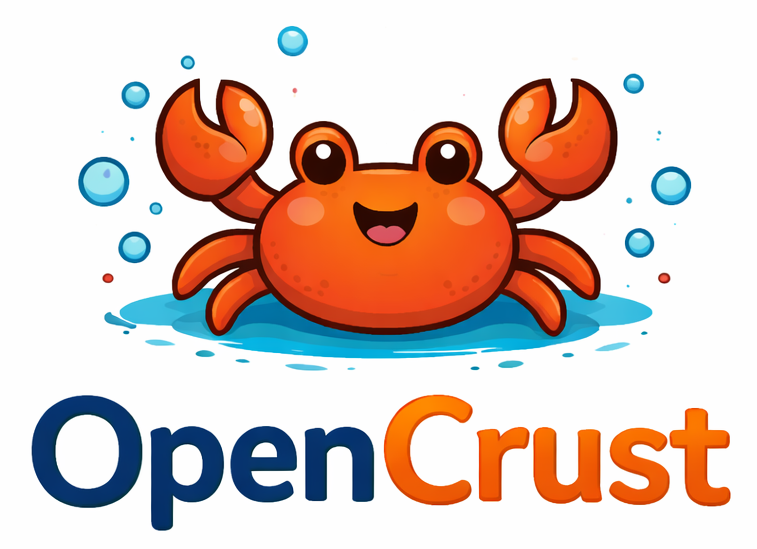

<p align="center">
  
</p>

<h1 align="center">OpenCrust</h1>

<p align="center">
  <strong>सुरक्षित और हल्का ओपन-सोर्स AI Agent फ्रेमवर्क।</strong>
</p>

<p align="center">
  <a href="https://github.com/opencrust-org/opencrust/actions"></a>
  <a href="https://github.com/opencrust-org/opencrust/blob/main/LICENSE"></a>
  <a href="https://github.com/opencrust-org/opencrust/stargazers"></a>
  <a href="https://github.com/opencrust-org/opencrust/issues"></a>
  <a href="https://github.com/opencrust-org/opencrust/issues?q=label%3Agood-first-issue+is%3Aopen"></a>
  <a href="https://discord.gg/aEXGq5cS"></a>
</p>

<p align="center">
  <a href="#शुरुआत-करें">शुरुआत करें</a> &middot;
  <a href="#opencrust-क्यों">OpenCrust क्यों?</a> &middot;
  <a href="#विशेषताएं">विशेषताएं</a> &middot;
  <a href="#सुरक्षा">सुरक्षा</a> &middot;
  <a href="#आर्किटेक्चर">आर्किटेक्चर</a> &middot;
  <a href="#openclaw-से-माइग्रेट-करें">OpenClaw से माइग्रेट करें</a> &middot;
  <a href="#योगदान">योगदान</a>
</p>

<p align="center">
  <a href="../README.md">🇺🇸 English</a> &middot;
  <a href="README.th.md">🇹🇭 ไทย</a> &middot;
  <a href="README.zh.md">🇨🇳 简体中文</a> &middot;
  🇮🇳 <strong>हिन्दी</strong>
</p>

---

16 MB का एक standalone binary जो Telegram, Discord, Slack, WhatsApp, LINE और iMessage पर आपका AI agent चलाता है — एन्क्रिप्टेड credential स्टोरेज, hot-reload config के साथ और idle में केवल 13 MB RAM उपयोग करता है। Rust में बनाया गया है — AI agent को जो सुरक्षा और स्थिरता चाहिए उसके लिए।

## शुरुआत करें

```bash
# इंस्टॉल करें (Linux, macOS)
curl -fsSL https://raw.githubusercontent.com/opencrust-org/opencrust/main/install.sh | sh

# इंटरेक्टिव सेटअप — LLM provider और channel चुनें
opencrust init

# शुरू करें — पहला संदेश मिलने पर agent खुद परिचय देगा और आपकी प्राथमिकताएं सीखेगा
opencrust start

# config, connectivity और database health जांचें
opencrust doctor
```

<details>
<summary>Source से Build करें</summary>

```bash
# Rust 1.85+ आवश्यक है
cargo build --release
./target/release/opencrust init
./target/release/opencrust start

# WASM plugin सपोर्ट (optional)
cargo build --release --features plugins
```
</details>

Linux (x86_64, aarch64), macOS (Intel, Apple Silicon) और Windows (x86_64) के लिए binary [GitHub Releases](https://github.com/opencrust-org/opencrust/releases) पर उपलब्ध हैं।

## OpenCrust क्यों?

### OpenClaw, ZeroClaw और अन्य फ्रेमवर्क से तुलना

| | **OpenCrust** | **OpenClaw** (Node.js) | **ZeroClaw** (Rust) |
|---|---|---|---|
| **Binary आकार** | 16 MB | ~1.2 GB (node_modules सहित) | ~25 MB |
| **Idle RAM** | 13 MB | ~388 MB | ~20 MB |
| **Cold start** | 3 ms | 13.9 s | ~50 ms |
| **Credential स्टोरेज** | AES-256-GCM vault | plaintext config file | plaintext config file |
| **डिफ़ॉल्ट Auth** | चालू (WebSocket pairing) | बंद | बंद |
| **Scheduling** | Cron, interval, one-shot | हाँ | नहीं |
| **Multi-agent routing** | planned (#108) | हाँ (agentId) | नहीं |
| **Session orchestration** | planned (#108) | हाँ | नहीं |
| **MCP support** | Stdio | Stdio + HTTP | Stdio |
| **Channels** | 6 | 6+ | 4 |
| **LLM providers** | 15 | 10+ | 22+ |
| **Pre-compiled binary** | हाँ | N/A (Node.js) | Source से Build |
| **Config hot-reload** | हाँ | नहीं | नहीं |
| **WASM plugin system** | Optional (sandboxed) | नहीं | नहीं |
| **Self-update** | हाँ (`opencrust update`) | npm | Source से Build |

*DigitalOcean droplet 1 vCPU, 1 GB RAM पर मापा गया — [खुद टेस्ट करें](../bench/)*

## सुरक्षा

OpenCrust को हमेशा चलने वाले AI agents के लिए डिज़ाइन किया गया है जो संवेदनशील डेटा तक पहुंचते हैं।

- **Encrypted credential vault** — API key और token AES-256-GCM के साथ `~/.opencrust/credentials/vault.json` पर संग्रहीत, disk पर कोई plaintext नहीं
- **डिफ़ॉल्ट Authentication** — WebSocket gateway को pairing code की आवश्यकता है, बिना authentication के कोई access नहीं
- **User allowlist** — per-channel allowlist नियंत्रित करता है कि agent से कौन interact कर सकता है, अनधिकृत संदेश चुपचाप छोड़ दिए जाते हैं
- **Prompt injection detection** — LLM तक पहुंचने से पहले input को validate और sanitize किया जाता है
- **WASM sandboxing** — WebAssembly runtime के माध्यम से optional plugin sandboxing (`--features plugins` के साथ compile करें)
- **Localhost-only binding** — gateway डिफ़ॉल्ट रूप से `0.0.0.0` नहीं बल्कि `127.0.0.1` से bind होता है

## विशेषताएं

### LLM Provider

**Native providers:**

- **Anthropic Claude** — streaming (SSE), tool use
- **OpenAI** — GPT-4o, Azure, `base_url` के माध्यम से OpenAI-compatible endpoints
- **Ollama** — streaming के साथ local models

**OpenAI-compatible providers:**

- **Sansa** — [sansaml.com](https://sansaml.com) के माध्यम से regional LLM
- **DeepSeek** — DeepSeek Chat
- **Mistral** — Mistral Large
- **Gemini** — OpenAI-compatible API के माध्यम से Google Gemini
- **Falcon** — TII Falcon 180B (AI71)
- **Jais** — Core42 Jais 70B
- **Qwen** — Alibaba Qwen Plus
- **Yi** — 01.AI Yi Large
- **Cohere** — Command R Plus
- **MiniMax** — MiniMax Text 01
- **Moonshot** — Kimi K2
- **vLLM** — vLLM के OpenAI-compatible server के माध्यम से self-hosted models

### Channels
- **Telegram** — streaming responses, MarkdownV2, bot commands, typing indicators, pairing code के साथ user allowlist, image/vision सपोर्ट, voice message (Whisper STT), file/document handling
- **Discord** — slash commands, event-driven message handling, session management
- **Slack** — Socket Mode, streaming responses, allowlist/pairing
- **WhatsApp** — Meta Cloud API webhooks, allowlist/pairing
- **LINE** — Messaging API webhooks, reply/push fallback, group/room chat सपोर्ट, allowlist/pairing
- **iMessage** — chat.db polling के माध्यम से macOS native, group chat, AppleScript sending ([सेटअप गाइड](../docs/imessage-setup.md))

### MCP (Model Context Protocol)
- किसी भी MCP server से connect करें (filesystem, GitHub, databases, web search)
- Tools native agent tools के रूप में namespace के साथ दिखाई देते हैं (`server.tool`)
- `config.yml` या `~/.opencrust/mcp.json` में configure करें (Claude Desktop compatible)
- CLI: `opencrust mcp list`, `opencrust mcp inspect <name>`

### Personality (DNA)
- पहला संदेश मिलने पर agent खुद परिचय देता है और प्राथमिकताएं सीखने के लिए सवाल पूछता है
- `~/.opencrust/dna.md` लिखता है जिसमें bot का नाम, communication style, guidelines और identity होती है
- कोई config file edit नहीं, कोई wizard नहीं — बस बात करें
- Hot-reload on edit — `dna.md` बदलें और agent तुरंत adapt हो जाता है
- OpenClaw से माइग्रेट हो रहे हैं? `opencrust migrate openclaw` मौजूदा `SOUL.md` को import करता है

### Agent Runtime
- Tool execution loop — bash, file_read, file_write, web_fetch, web_search, schedule_heartbeat (अधिकतम 10 rounds)
- vector search के साथ SQLite पर conversation memory (sqlite-vec + Cohere embeddings)
- Context window management — context window के 75% पर rolling conversation summarization
- Scheduled tasks — cron, interval और one-shot scheduling

### Skills
- Agent skills को YAML frontmatter के साथ Markdown files (SKILL.md) के रूप में define करें
- `~/.opencrust/skills/` से auto-discovery — system prompt में automatically inject होती हैं
- CLI: `opencrust skill list`, `opencrust skill install <url>`, `opencrust skill remove <name>`

### Infrastructure
- **Config hot-reload** — `config.yml` बदलें और restart किए बिना changes तुरंत लागू होते हैं
- **Daemonization** — PID management के साथ `opencrust start --daemon`
- **Self-update** — `opencrust update` SHA-256 verification के साथ latest release download करता है, rollback के लिए `opencrust rollback`
- **Restart** — `opencrust restart` gracefully stop और restart करता है
- **Runtime provider switching** — restart किए बिना webchat UI या REST API के माध्यम से LLM provider जोड़ें या बदलें
- **Migration tool** — `opencrust migrate openclaw` skills, channels और credentials import करता है
- **Conversation summarization** — 75% context window पर rolling summary, restart के बाद session summary persist होती है
- **Interactive setup** — provider और channels configure करने के लिए `opencrust init` wizard
- **Diagnostics** — `opencrust doctor` config, data directory, credential vault, LLM provider reachability, channel credentials, MCP server connectivity और database integrity जांचता है

## OpenClaw से माइग्रेट करें?

एक command में skills, channel config, credentials (vault में encrypt) और personality (`SOUL.md` से `dna.md`) import करें:

```bash
opencrust migrate openclaw
```

commit करने से पहले preview के लिए `--dry-run` उपयोग करें, OpenClaw config directory specify करने के लिए `--source /path/to/openclaw` उपयोग करें।

## Configuration

OpenCrust `~/.opencrust/config.yml` से config पढ़ता है:

```yaml
gateway:
  host: "127.0.0.1"
  port: 3888

llm:
  claude:
    provider: anthropic
    model: claude-sonnet-4-5-20250929
    # api_key: vault > config > ANTHROPIC_API_KEY env var से पढ़ा जाता है

  ollama-local:
    provider: ollama
    model: llama3.1
    base_url: "http://localhost:11434"

channels:
  telegram:
    type: telegram
    enabled: true
    bot_token: "your-bot-token"  # या TELEGRAM_BOT_TOKEN env var

  line:
    type: line
    enabled: true
    channel_access_token: "your-access-token"
    channel_secret: "your-secret"

agent:
  # Personality ~/.opencrust/dna.md के माध्यम से configure होती है
  max_tokens: 4096
  max_context_tokens: 100000

memory:
  enabled: true

# External tools के लिए MCP servers
mcp:
  filesystem:
    command: npx
    args: ["-y", "@modelcontextprotocol/server-filesystem", "/tmp"]
```

सभी options के लिए [full configuration reference](../docs/) देखें, जिसमें Discord, Slack, WhatsApp, iMessage, embeddings और MCP servers शामिल हैं।

## आर्किटेक्चर

```
crates/
  opencrust-cli/        # CLI, init wizard, daemon management
  opencrust-gateway/    # WebSocket gateway, HTTP API, sessions
  opencrust-config/     # YAML/TOML loading, hot-reload, MCP config
  opencrust-channels/   # Discord, Telegram, Slack, WhatsApp, LINE, iMessage
  opencrust-agents/     # LLM providers, tools, MCP client, agent runtime
  opencrust-db/         # SQLite memory, vector search (sqlite-vec)
  opencrust-plugins/    # WASM plugin sandbox (wasmtime)
  opencrust-media/      # Media processing (scaffolded)
  opencrust-security/   # Credential vault, allowlists, pairing, validation
  opencrust-skills/     # SKILL.md parser, scanner, installer
  opencrust-common/     # Shared types, errors, utilities
```

| Component | स्थिति |
|-----------|--------|
| Gateway (WebSocket, HTTP, sessions) | उपलब्ध |
| Telegram (streaming, commands, pairing, photos, voice, documents) | उपलब्ध |
| Discord (slash commands, sessions) | उपलब्ध |
| Slack (Socket Mode, streaming) | उपलब्ध |
| WhatsApp (webhooks) | उपलब्ध |
| LINE (webhooks, reply/push fallback) | उपलब्ध |
| iMessage (macOS, group chats) | उपलब्ध |
| LLM providers (15: Anthropic, OpenAI, Ollama + 12 OpenAI-compatible) | उपलब्ध |
| Agent tools (bash, file_read, file_write, web_fetch, web_search, schedule_heartbeat) | उपलब्ध |
| MCP client (stdio, tool bridging) | उपलब्ध |
| Skills (SKILL.md, auto-discovery) | उपलब्ध |
| Config (YAML/TOML, hot-reload) | उपलब्ध |
| Personality (DNA bootstrap, hot-reload) | उपलब्ध |
| Memory (SQLite, vector search, summarization) | उपलब्ध |
| Security (vault, allowlist, pairing) | उपलब्ध |
| Scheduling (cron, interval, one-shot) | उपलब्ध |
| CLI (init, start/stop/restart, update, migrate, mcp, skills, doctor) | उपलब्ध |
| Plugin system (WASM sandbox) | Scaffolded |
| Media processing | Scaffolded |

## योगदान

OpenCrust MIT license के तहत open source है। contributors के साथ बात करने, सवाल पूछने या जो आप बना रहे हैं उसे share करने के लिए [Discord](https://discord.gg/aEXGq5cS) join करें। setup instructions, coding guidelines और crate overview के लिए [CONTRIBUTING.md](../CONTRIBUTING.md) देखें।

### वर्तमान प्राथमिकताएं

| प्राथमिकता | Issue | विवरण |
|-----------|-------|--------|
| **P0** | [#103](https://github.com/opencrust-org/opencrust/issues/103) | README और positioning |
| **P0** | [#104](https://github.com/opencrust-org/opencrust/issues/104) | Website: opencrust.org |
| **P0** | [#105](https://github.com/opencrust-org/opencrust/issues/105) | Discord community |
| **P1** | [#106](https://github.com/opencrust-org/opencrust/issues/106) | Built-in starter skills |
| **P1** | [#107](https://github.com/opencrust-org/opencrust/issues/107) | Scheduling hardening |
| **P1** | [#108](https://github.com/opencrust-org/opencrust/issues/108) | Multi-agent routing |
| **P1** | [#109](https://github.com/opencrust-org/opencrust/issues/109) | Install script |
| **P1** | [#110](https://github.com/opencrust-org/opencrust/issues/110) | Linux aarch64 + Windows releases |
| **P1** | [#80](https://github.com/opencrust-org/opencrust/issues/80) | MCP: HTTP transport, resources, prompts |

शुरुआत के लिए [सभी issues](https://github.com/opencrust-org/opencrust/issues) देखें या [`good-first-issue`](https://github.com/opencrust-org/opencrust/issues?q=label%3Agood-first-issue+is%3Aopen) से filter करें।

## License

MIT
